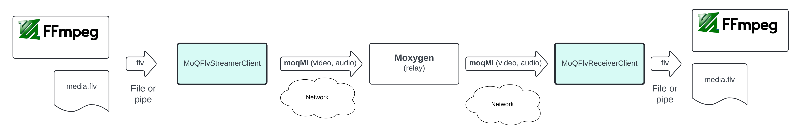
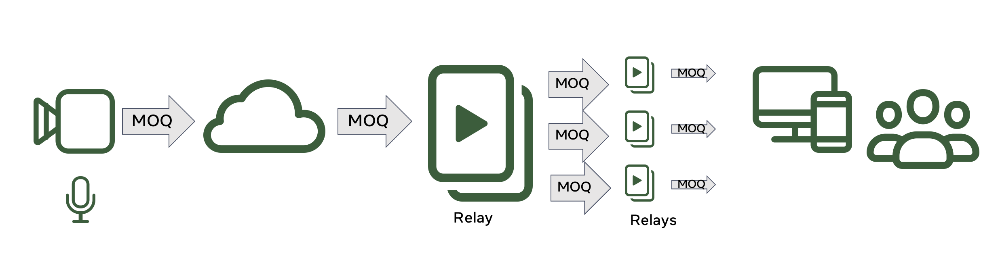

# moxygen


## how to use (by https://github.com/facebookexperimental/moq-encoder-player/issues/24)

Start webserver for player (terminal 0)
 
```
cd ./moq-encoder-player
./create_self_signed_certs.sh
./start-http-server-cross-origin-isolated.py
```

Build relay 
```
cd moxygen
./build.sh
```

Start relay (terminal1 )
./_build/bin/moqrelayserver -port 4433 -cert ../moq-encoder-player/certs/certificate.pem -key ../moq-encoder-player/certs/certificate.key -endpoint "/moq" --logging DBG1


Generate live data from ffmpeg to a FIFO (terminal 2)
rm ~/Movies/fifo.flv
mkfifo ~/Movies/fifo.flv
ffmpeg -y -f lavfi -re -i smptebars=duration=300:size=320x200:rate=30 -f lavfi -re -i sine=frequency=1000:duration=300:sample_rate=48000 -pix_fmt yuv420p -c:v libx264 -b:v 180k -g 60 -keyint_min 60 -profile:v baseline -preset veryfast -c:a aac -b:a 96k -vf "drawtext=fontfile=/usr/share/fonts/dejavu-sans-fonts/DejaVuSans.ttf: text=\'Local time %{localtime\: %Y\/%m\/%d %H.%M.%S} (%{n})\': x=10: y=10: fontsize=12: fontcolor=white: box=1: boxcolor=0x00000099" -f flv ~/Movies/fifo.flv

Start FLV Streamer (terminal 3)
./_build/bin/moqflvstreamerclient -input_flv_file ~/Movies/fifo.flv --logging DBG4

Open webplayer
- Open chrome with http://localhost:8080/src-player/index.html?local&verbose=1&host=moq://localhost:4433/moq
- Set Namespace to flvstreamer
- Remove trackname
- Press start

## Local test with web media client

Assuming all running in localhost

- Execute (from project root dir)
```
./_build/bin/moqrelayserver -port 4433 -cert [moq-encoder-player]/certs/certificate.pem -key [moq-encoder-player]/certs/certificate.key -endpoint "/moq" --logging DBG
```

Note: [moq-encoder-player] indicate the root directory of that project. So you need to use those certs to enable connections from Chrome to localhost

- Start client (MACOS)
Run MOQ encoder / player in the browser locally
   - Open a Chrome window and follow the instructions you will find in [moq-encoder-player](https://github.com/facebookexperimental/moq-encoder-player)

## Test with media streamer and media receiver

To simplify testing MOQ at media level we added the following binaries to the repo `MoQFlvStreamerClient` and `MoQFlvReceiverClient`.


Fig3: MoQFlvStreamerClient, MoQFlvReceiverClient, and moxygen

- `MoQFlvStreamerClient`: Convert any FLV (h264 / AAC-LC) file or stream (fifo) into MOQ, publishing it to a relay using MoqMi packager (see RFC [draft-cenzano-moq-media-interop](https://datatracker.ietf.org/doc/draft-cenzano-moq-media-interop/))

- `MoQFlvReceiverClient`: Subscribes to a relay for a video and audio track, demuxes them from MoqMi (expecting h264 / AAC-LC), transmuxes them to FLV and saves that to disc (or stream using fifo)

They work with FLV packager. Since [ffmpeg](https://www.ffmpeg.org/ffmpeg.html) is able to mux and / or demux this packager in low latency and real time very nice you can build a huge variety of tests set ups, for more information and examples take a look to [READMOQMEDIA.md](./READMOQMEDIA.md)

## Test with web media client
- You can use [moq-encoder-player](https://github.com/facebookexperimental/moq-encoder-player) as encoder (publisher), and also as player (consumer)

- You need to install that website ([moq-encoder-player](https://github.com/facebookexperimental/moq-encoder-player)) in a https server (apache2 recommended)
   - It will requiere to enable cross origin isolation (see [link](https://stackoverflow.com/questions/76077439/enabling-cross-origin-isolation-on-the-apache2-web-server)) on the player side

- To start the relay you can do (from project root dir)
```
./_build/bin/moqrelayserver -port 4433 -cert ./certs/certificate.pem -key ./certs/certificate.key -endpoint "/moq" --logging DBG
```

## Installation

- Just execute (probably you will need `sudo` unless you run it like `root`):
```
./build.sh
```

## Test preconditions
- Generate self signed certificate for the server applications
```
cd scripts
./create-server-certs.sh
```


### Test with date server

- Execute date server (from project root dir)
```
./_build/bin/moqdateserver -port 4433 -cert ./certs/certificate.pem -key ./certs/certificate.key --logging DBG1
```

- Execute text client
```
./_build/bin/moqtextclient --connect_url "https://localhost:4433/moq-date" --track_namespace "moq-date" --track_name "date"
```

- You should see an output like:
```
E0520 13:08:07.722896 7064889 MoQTextClient.cpp:148] Invalid url: localhost:4433/moq-date
I0520 13:08:07.723534 7064889 MoQTextClient.cpp:27] run
I0520 13:08:07.723554 7064889 MoQClient.cpp:31] setupMoQSession
I0520 13:08:07.729465 7064889 MoQClient.cpp:16] connectSuccess
I0520 13:08:07.731674 7064889 MoQClient.cpp:33] exit setupMoQSession
I0520 13:08:07.731702 7064889 MoQTextClient.cpp:94] controlReadLoop
I0520 13:08:07.731714 7064889 MoQSession.h:57] ServerSetup, version=4278190082
I0520 13:08:07.733063 7064889 MoQClient.cpp:137] onWebTransportUniStream
I0520 13:08:07.733076 7064889 MoQClient.cpp:137] onWebTransportUniStream
I0520 13:08:07.733080 7064889 MoQClient.cpp:137] onWebTransportUniStream
I0520 13:08:07.733082 7064889 MoQClient.cpp:137] onWebTransportUniStream
I0520 13:08:07.733084 7064889 MoQClient.cpp:137] onWebTransportUniStream
I0520 13:08:07.733086 7064889 MoQClient.cpp:137] onWebTransportUniStream
I0520 13:08:07.733089 7064889 MoQClient.cpp:137] onWebTransportUniStream
I0520 13:08:07.733091 7064889 MoQClient.cpp:137] onWebTransportUniStream
I0520 13:08:07.733094 7064889 MoQClient.cpp:137] onWebTransportUniStream
I0520 13:08:07.733716 7064889 MoQTextClient.cpp:107] readTrack
7
6
5
4
3
2
1
0
2024-05-20 13:08:
I0520 13:08:08.336642 7064889 MoQClient.cpp:137] onWebTransportUniStream
8
I0520 13:08:09.344473 7064889 MoQClient.cpp:137] onWebTransportUniStream
9
I0520 13:08:10.346489 7064889 MoQClient.cpp:137] onWebTransportUniStream
10
I0520 13:08:11.351163 7064889 MoQClient.cpp:137] onWebTransportUniStream
11
```


## License

moxygen is released under the [MIT License](https://github.com/facebookexperimental/moqxygen/blob/main/LICENSE).


## what is moqgen

This is an experimental media MOQ relay (AKA: CDN node) based on [MOQT](https://datatracker.ietf.org/doc/draft-ietf-moq-transport/). It can be used in conjunction with following live encoder and player [moq-encoder-player](https://github.com/facebookexperimental/moq-encoder-player). Both repos allows us create a live streaming platform where we can control latency and quality (and others), so we can test scenarios from ultra low latency live (video call) to high quality (and high scale) live.


Fig1: Basic block diagram

In the following figure you can see an overview of the relay architecture

TODO
Fig2: Relay architecture overview